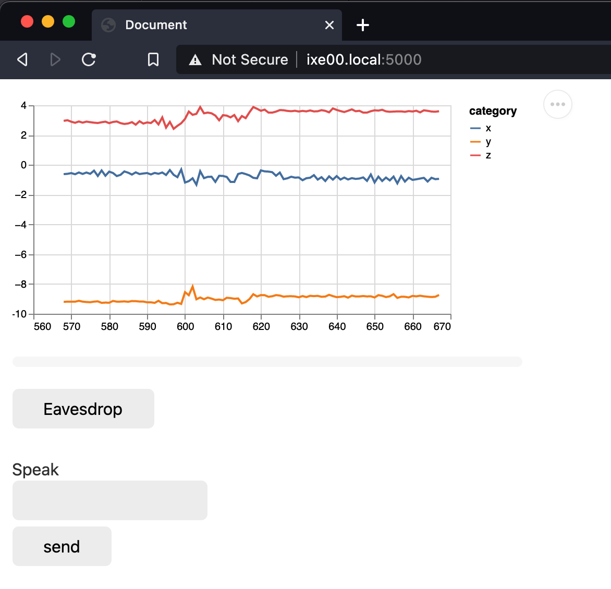

# Magic Ball WoZ

This is a Demo App for a Wizard of Oz interactive system where the wizard is playing a magic 8 ball


## Hardware Set-Up

For this demo, you will need: 
* your Raspberry Pi, 
* a Qwiic/Stemma Cable, 
* the display (we are just using it for the Qwiic/StemmaQT port. Feel free to use the display in your projects), 
* your accelerometer, and 
* your web camera


<p float="left">


Plug the display in and connect the accelerometer to the port underneath with your Qwiic connector cable. Plug the web camera into the raspberry pi. 

## Software Setup

Ssh on to your Raspberry Pi as we've done previously

`ssh pi@yourHostname.local`

Ensure audio is playing through the aux connector by typing

`sudo raspi-config`

on `system options` hit enter. Go down to `s2 Audio` and hit enter. Select `1 USB Audio` and hit enter. Then navigate to `<Finish>` and exit the config menu.

We will need one additional piece of software called VLC Media player. To install it type `sudo apt-get install vlc` 


I would suggest making a new virtual environment for this demo then navigating to this folder and installing the requirements.

```
pi@yourHostname:~ $ virtualenv woz
pi@yourHostname:~ $ source woz/bin/activate
(woz) pi@yourHostname:~ $ cd Interactive-Lab-Hub/Lab\ 3/demo
(woz) pi@yourHostname:~/Interactive-Lab-Hub/Lab 3/demo $ 
(woz) pi@yourHostname:~/Interactive-Lab-Hub/Lab 3/demo $ pip install -r requirements.txt
```

## Running

To run the app

`(woz) pi@yourHostname:~/Interactive-Lab-Hub/Lab 3/demo $ python app.py`

In the browser of a computer on the same network, navigate to http://yourHostname.local:5000/ where in my case my hostname is ixe00



The interface will immediately begin streaming the accelerometer to let you know if your participant shakes their Magic 8 ball. The "eavesdrop" button will begin streaming audio from the Pi to your browser (note there is a noticeable delay it is best to start eavesdropping right at the beginning). To have the Pi speak, you can write in the text box and hit send or press enter.

## Notes

You may need to change line 26 in `app.py`

```
hardware = 'plughw:2,0'
```

This is the soundcard and hardware device associated with the USB microphone. To check, you can run `python get_device.py` which will output A LOT of nonsense. At the end, you will see 

```
0 bcm2835 Headphones: - (hw:0,0)
1 webcamproduct: USB Audio (hw:2,0)
2 sysdefault
3 lavrate
4 samplerate
5 speexrate
6 pulse
7 upmix
8 vdownmix
9 dmix
10 default
```

In our case, `webcamproduct: USB Audio (hw:2,0)` is the name of our microphone and the index is in parenthesis.

